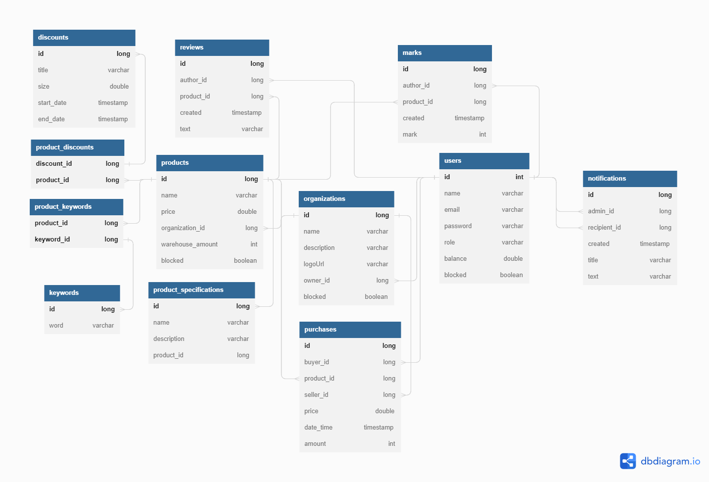

# Shop
Simple internet shop project.  

1. Инструкция по запуску  
* Для тестов используется база данных H2, её настройки хранятся в папке /test/resources  
Можно запускать тесты по одному, можно весь тестовый класс, можно "Run All Tests"
* Команда "docker-compose up" запускает сервис с бд PostgreSQL

2. Технологии  
Java 17, Spring Boot, Maven, Hibernate, JUnit, PostgreSQL, Lombok, Docker, H2 (test)   
    

3. Схема базы данных

4. ТЗ в файле Interview tasks.md

